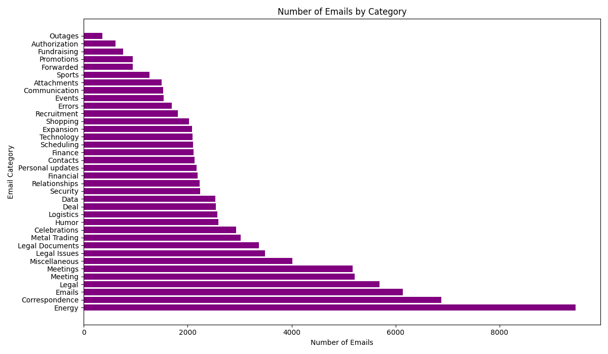

# Enron-Email-Classification

The point of this project is to use Faiss to cluster emails and to use ChatGPT to categorize these emails. Here is an example graph based on a subset of 100,000 emails:



## Multithreading

Importing data was taking a very long time. To speed up this up I added multiple threads decreasing the time to import all 500,000 emails from 2 hours and 30 minutes to about 18 minutes.

## Database

While I was originally using json to store my data, to do the more complex operations I want to for my future vision of this project, I decided to use an SQLite database.

## How to run

If you do not have the dataset install please run `download_and_extract.py`. This will download the dataset for you. Once the dataset is downloaded, you can import the data into Faiss and the SQLite db by running `import_data.py`. Once data has been imported you can run `vector_db.py` to add the categorize.

> [!note]
> You will need to create a `.env` file and add an OpenAI API key:
> ```
> OPENAI_API_KEY=[ENTER-KEY-HERE]
> ```

## Next Steps

Here are the things I want to add to this project: 

- Frontend using NextJS and React 
- Way to see what types of emails people are sending to each other (EX: Pam send Joe marketing emails and Joe send Pam Spam emails)
- Scatter plot vectors in 2d with colors for each Catagory
- Make it so ChatGPT cannot repeat categorize
- Make ChatGPT be more specific about their categorizes
- Create an interactive scatter plot where users can move around and select emails on the plots and see how they relate to other emails 
- Implement a vector search 
- Be able to use the data in this repo to train a Machine Learning model on how to classify emails

